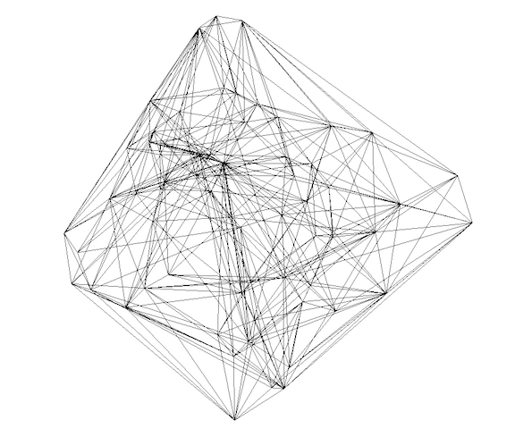

# CDT-plusplus

[](https://travis-ci.org/acgetchell/CDT-plusplus)
[](https://ci.appveyor.com/project/acgetchell/cdt-plusplus)
[](https://github.com/acgetchell/CDT-plusplus/actions)
[](https://lgtm.com/projects/g/acgetchell/CDT-plusplus/context:cpp)
[](https://lgtm.com/projects/g/acgetchell/CDT-plusplus/context:python)
[](https://github.com/acgetchell/CDT-plusplus/issues)
[](https://gitter.im/acgetchell/CDT-plusplus)

**Quantize spacetime on your laptop.**



For an introduction to [Causal Dynamical Triangulations](https://github.com/acgetchell/CDT-plusplus/wiki),
including the foundations and recent results, please see the [wiki](https://github.com/acgetchell/CDT-plusplus/wiki).

[Causal Dynamical Triangulations][CDT] in [C++] uses the
[Computational Geometry Algorithms Library][CGAL], [Boost], [TBB], and [Eigen].
Arbitrary-precision numbers and functions via [MPFR] and [GMP].
Uses [Docopt] to provide a beautiful command-line interface.
Uses [Melissa E. O'Neill's Permuted Congruential Generators][PCG] library for high-quality RNGs that pass L'Ecuyer's
[TestU01] statistical tests.
Uses [Catch] for [BDD]/[TDD].
Uses [vcpkg] for library management and building.
Uses [Doxygen] for automated document generation.

The goals and targets of this project are:

- [x] Developed with [literate programming] using [Doxygen]
- [x] [Efficient Pure Functional Programming in C++ Using Move Semantics][functional]
- [x] Validation tests using [CTest]
- [x] Behavior-driven development ([BDD]) with [Catch]
- [x] Continuous integration on MacOS and Linux with [gcc]/[Clang] using [Travis-CI]
- [x] Continuous integration on Windows with [MSVC] using [AppVeyor]
- [x] Continuous integration with [Github Actions]
- [x] 3D Simplex
- [x] 3D Spherical triangulation
- [x] 2+1 foliation
- [x] Integrate [Docopt] CLI
- [x] S3 Bulk action
- [x] 3D Ergodic moves
- [x] High-quality Random Number Generation with M.E. O'Neill's [PCG] library
- [x] Multithreading via [TBB]
- [x] Automated code analysis with [LGTM]
- [ ] Metropolis algorithm
- [ ] Output via [HDF5]
- [ ] A [Surface mesh] manifold of 3D Triangulation
- [ ] 4D Simplex
- [ ] 4D Spherical triangulation
- [ ] 3+1 foliation
- [ ] S4 Bulk action
- [ ] 4D Ergodic moves
- [ ] Initialize two masses
- [ ] Shortest path algorithm
- [ ] Einstein tensor
- [ ] Complete test coverage
- [ ] Complete documentation
- [ ] Quantize Spacetime!

## Getting Started

If you just want to run a stable version of the code, grab a versioned [release].

Otherwise, you can clone the repo, including submodules, as follows:

~~~
git clone --recurse-submodules https://github.com/acgetchell/CDT-plusplus.git
~~~

(Older versions of `git` may require `--recursive` instead of `--recurse-submodules`.)

This will put you on the [development] branch. Project is in the [PitchFork Layout], as follows:

- .github - GitHub specific settings
- build - Ephemeral out-of-source build directory
- docs - Documentation
- external - Includes external projects, e.g. [PCG]
- include - Header files
- src - Source files
- tests - Unit tests
- tools - Build, test, and run scripts

### Setup

Install [vcpkg]:

```bash
git clone https://github.com/Microsoft/vcpkg.git
cd vcpkg
./bootstrap-vcpkg.sh
./vcpkg integrate install
```

Next, you will need to install up to date versions of [CMake] and [Ninja]. On non-Windows platforms, you will also need
`yasm` so that `vcpkg` can install [mpir], which is required for [CGAL].

MacOS using [homebrew]:

```bash
brew install cmake
brew install ninja
brew install yasm
```
Linux using [apt] (you may also need to install [m4]):
```bash
sudo apt-get install cmake
sudo apt-get install ninja-build
sudo apt-get install yasm
sudo apt-get install m4
```

At minimum, we need to install prerequisites [Catch], [docopt], [ms-gsl], [Eigen], [tbb], and [CGAL]
(which installs [boost], [mpir] and [mpfr]):

```bash
./vcpkg install catch2
./vcpkg install docopt
./vcpkg install ms-gsl
./vcpkg install eigen3
./vcpkg install tbb
./vcpkg install cgal
```

This builds from source, so it will take awhile. To use these successfully, you'll need to
set the `CMAKE_TOOLCHAIN_FILE` option in your IDE or whatever invokes [CMake] to wherever
you've installed [vcpkg], (e.g. your home directory):

```bash
-DCMAKE_TOOLCHAIN_FILE=$HOME/vcpkg/scripts/buildsystems/vcpkg.cmake
```

This project uses [C++]17 features, and successfully builds with AppleClang, [gcc-9], and [clang-7].
On Ubuntu, you may need updated versions of [Clang] or [gcc], and [CMake], which is scripted in [.travis.yml].

### Building

```bash
cd tools
./build.sh
```

This should result in the main program executable, `cdt` in the `build/bin` directory, along with several others.

- `CDT_test` is the [Catch] executable which runs the unit tests
- `cdt-gv` converts output files to [Geomview] format for visualization
- `cdt-opt` is a simplified version with hard-coded inputs, mainly useful for debugging and scripting
- `initialize` is used by [CometML] to run [parameter optimization](#parameter-optimization)

The install script will also run unit and integration tests.
See [Testing](#testing) for details.

## Usage

CDT-plusplus uses [Docopt] to parse options from the help message, and so
understands long or short argument formats, provided the short argument given
is an unambiguous match to a longer one. The help message should be instructive:

~~~text
./build/cdt --help
Causal Dynamical Triangulations in C++ using CGAL.

Copyright (c) 2014-2019 Adam Getchell

A program that generates d-dimensional triangulated spacetimes
with a defined causal structure and evolves them according
to the Metropolis algorithm. Specify the number of passes to control
how much evolution is desired. Each pass attempts a number of ergodic
moves equal to the number of simplices in the simulation.

Usage:./cdt (--spherical | --toroidal) -n SIMPLICES -t TIMESLICES [-d DIM] -k K --alpha ALPHA --lambda LAMBDA [-p PASSES] [-c CHECKPOINT]

Examples:
./cdt --spherical -n 32000 -t 11 --alpha 0.6 -k 1.1 --lambda 0.1 --passes 1000
./cdt --s -n32000 -t11 -a.6 -k1.1 -l.1 -p1000

Options:
  -h --help                   Show this message
  --version                   Show program version
  -n SIMPLICES                Approximate number of simplices
  -t TIMESLICES               Number of timeslices
  -d DIM                      Dimensionality [default: 3]
  -a --alpha ALPHA            Negative squared geodesic length of 1-d
                              timelike edges
  -k K                        K = 1/(8*pi*G_newton)
  -l --lambda LAMBDA          K * Cosmological constant
  -p --passes PASSES          Number of passes [default: 100]
  -c --checkpoint CHECKPOINT  Checkpoint every n passes [default: 10]
~~~

The dimensionality of the spacetime is such that each slice of spacetime is
`d-1`-dimensional, so setting `d=3` generates 2 spacelike dimensions and one
timelike dimension, with a defined global time foliation. Thus a
`d`-dimensional simplex will have some `d-1` sub-simplices that are purely
spacelike (all on the same timeslice) as well as some that are timelike
(span two timeslices). In [CDT] we actually care more about the timelike
links (in 2+1 spacetime) and the timelike faces (in 3+1 spacetime).

## Documentation

Online documentation may be found at <https://adamgetchell.org/CDT-plusplus/> automatically generated by [Travis-CI].
If you have [Doxygen] installed you can generate the same information
locally using the configuration file in `docs\Doxyfile` by simply typing at the top
level directory ([Doxygen] will recursively search):

~~~bash
doxygen ./docs/Doxyfile
~~~

This will generate a `docs/html/` directory containing
documentation generated from CDT++ source files. `USE_MATHJAX` has been enabled
in [Doxyfile] so that the LaTeX formulae can be rendered in the html
documentation using [MathJax]. `HAVE_DOT` is set to **YES** which allows
various graphs to be autogenerated by [Doxygen] using [GraphViz].
If you do not have GraphViz installed, set this option to **NO**
(along with `UML_LOOK`).

## Testing

Unit tests using [Catch] are run (in the `build/tests` directory) via:

~~~bash
./CDT_test
~~~

You can also run both [CTest] integration and [Catch] unit tests in the `build` directory with:

~~~bash
ctest
~~~

In addition to the command line output, you can see detailed results in the
`build/Testing` directory which is generated thereby.
`build/Testing` directory which is generated thereby.

### Static Analysis

This project follows the [CppCore Guidelines][guidelines] as enforced by [ClangTidy], which you can install
and then run using the [clang-tidy.sh] script:

~~~bash
sudo apt-get install clang-tidy
cd tools
./clang-tidy.sh
~~~

(Or use your favorite linter plugin for your editor/IDE.)

The [cppcheck-build.sh] script runs a quick static analysis using [cppcheck].

~~~bash
brew install cppcheck
cd tools
./cppcheck-build.sh
~~~

[Clang] comes with [scan-build] which can run a much more thorough,
but slower static analysis integrated with [CMake] and [Ninja].

~~~bash
./scan.sh
~~~

## Parameter Optimization

[CometML] is used to record [Experiments] which conduct [Model Optimization]. The script to do
this is `optimize-initialize.py`. In order for this to work, you must install the following
into your Python [virtual environment].

~~~bash
pip install tensorflow
pip install comet-ml
~~~

You can then run experiments and look at results on https://www.comet.ml!

## Contributing

Please see [CONTRIBUTING.md] and our [CODE_OF_CONDUCT.md].

Your code should pass Continuous Integration:

- [ClangTidy] on all changed files

- Whitespace formatting (`git diff --check HEAD^`)

- [Valgrind]; be sure to look at the results to ensure you're not leaking memory

- [LGTM]; check to ensure you haven't introduced a security vulnerability. Look at the [query console] for
more details.


## Upstream issues

- As of 2018-11-29, the [vcpkg] formula for [date] is [broken][1], so I removed reliance on that library.
Hopefully it will be back in C++20! Until then, I use Boost.Date_Time on macOS/Linux and (unsafe) std::localtime
on Windows, as Boost.Date_Time [doesn't link][2] correctly.

- As of 2019-10-16 [vcpkg] doesn't [build][3] on macOS 10.14 (but does on 10.15).

[CDT]: https://arxiv.org/abs/hep-th/0105267
[CGAL]: https://www.cgal.org
[CMake]: https://www.cmake.org
[Clang]: https://clang.llvm.org
[gcc]: https://gcc.gnu.org/
[Catch]: https://github.com/catchorg/Catch2/blob/master/docs/Readme.md
[guidelines]: https://isocpp.github.io/CppCoreGuidelines/CppCoreGuidelines
[clang-tidy.sh]: https://github.com/acgetchell/CDT-plusplus/blob/master/clang-tidy.sh
[CTest]: https://gitlab.kitware.com/cmake/community/wikis/doc/ctest/Testing-With-CTest
[Travis-CI]: https://travis-ci.com/getting_started
[literate programming]: http://www.literateprogramming.com
[Doxygen]: http://www.doxygen.org
[Homebrew]: https://brew.sh
[release]: https://github.com/acgetchell/CDT-plusplus/releases
[Ninja]: https://ninja-build.org
[Docopt]: https://github.com/docopt/docopt.cpp
[Mathjax]: https://www.mathjax.org
[GraphViz]: https://www.graphviz.org
[Eigen]: http://eigen.tuxfamily.org/index.php?title=Main_Page
[CMakeLists.txt]: https://github.com/acgetchell/CDT-plusplus/blob/master/CMakeLists.txt
[MPFR]: https://www.mpfr.org
[GMP]: https://gmplib.org
[HDF5]: https://www.hdfgroup.org
[scan-build]: https://clang-analyzer.llvm.org/scan-build.html
[scan.sh]: https://github.com/acgetchell/CDT-plusplus/blob/master/scan.sh
[cppcheck]: http://cppcheck.sourceforge.net
[cppcheck-build.sh]: https://github.com/acgetchell/CDT-plusplus/blob/master/cppcheck-build.sh
[functional]: https://blog.knatten.org/2012/11/02/efficient-pure-functional-programming-in-c-using-move-semantics/
[TBB]: https://www.threadingbuildingblocks.org
[CDT++]: https://github.com/acgetchell/CDT-plusplus
[.travis.yml]: https://github.com/acgetchell/CDT-plusplus/blob/master/.travis.yml
[Doxyfile]: https://github.com/acgetchell/CDT-plusplus/blob/master/Doxyfile
[Boost]: https://www.boost.org
[contrib]: https://github.com/acgetchell/CDT-plusplus/blob/master/CONTRIBUTING.md
[ClangTidy]: https://releases.llvm.org/6.0.1/tools/clang/tools/extra/docs/clang-tidy/index.html
[Valgrind]: http://valgrind.org/docs/manual/quick-start.html#quick-start.mcrun
[conduct]: https://github.com/acgetchell/CDT-plusplus/blob/master/CODE_OF_CONDUCT.md
[date]: https://howardhinnant.github.io/date/date.html
[AppVeyor]: https://www.appveyor.com
[BDD]: https://en.wikipedia.org/wiki/Behavior-driven_development
[TDD]: https://en.wikipedia.org/wiki/Test-driven_development
[.appveyor.yml]: https://github.com/acgetchell/CDT-plusplus/blob/master/.appveyor.yml
[LGTM]: https://lgtm.com/projects/g/acgetchell/CDT-plusplus/
[CometML]: https://www.comet.ml/
[Experiments]: https://www.comet.ml/acgetchell/cdt-plusplus
[Model Optimization]: https://www.comet.ml/parameter-optimization
[virtual environment]: https://docs.python.org/3/tutorial/venv.html
[vcpkg]: https://github.com/Microsoft/vcpkg
[clang-7]: https://releases.llvm.org/7.0.0/tools/clang/docs/ReleaseNotes.html
[gcc-9]: https://gcc.gnu.org/gcc-9/
[C++]: https://isocpp.org/
[Geomview]: http://www.geomview.org/
[development]: https://github.com/acgetchell/CDT-plusplus
[Pitchfork Layout]: https://api.csswg.org/bikeshed/?force=1&url=https://raw.githubusercontent.com/vector-of-bool/pitchfork/develop/data/spec.bs#tld.docs
[Surface mesh]: https://doc.cgal.org/latest/Surface_mesher/index.html
[PCG]: http://www.pcg-random.org/paper.html
[TestU01]: http://simul.iro.umontreal.ca/testu01/tu01.html
[apt]: https://wiki.debian.org/Apt
[ms-gsl]: https://github.com/microsoft/GSL
[mpir]: http://mpir.org/
[MSVC]: https://docs.microsoft.com/en-us/cpp/build/reference/compiling-a-c-cpp-program?view=vs-2019
[m4]: https://www.gnu.org/software/m4/
[1]: https://github.com/microsoft/vcpkg/issues/9082
[2]: https://github.com/microsoft/vcpkg/issues/9087
[3]: https://github.com/microsoft/vcpkg/issues/8627
[CONTRIBUTING.md]: https://github.com/acgetchell/CDT-plusplus/blob/develop/.github/CONTRIBUTING.md
[CODE_OF_CONDUCT.md]: https://github.com/acgetchell/CDT-plusplus/blob/develop/.github/CODE_OF_CONDUCT.md
[query console]: https://lgtm.com/query/lang:cpp/
[Github Actions]: https://github.com/features/actions