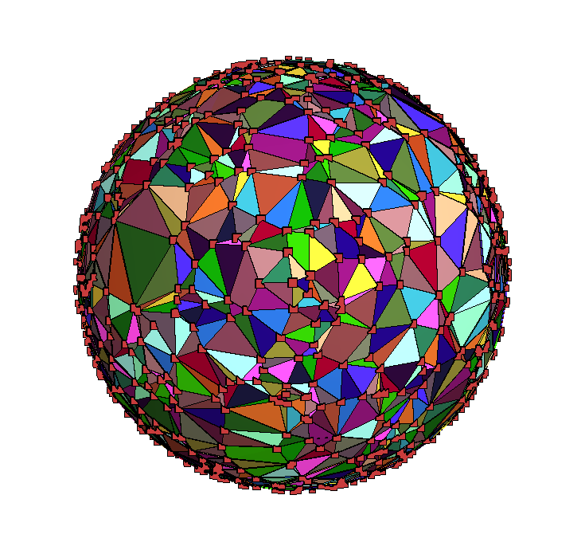

# CDT-plusplus

**Quantize spacetime on your laptop.**

[](https://doi.org/10.5281/zenodo.21487043)
[](https://github.com/acgetchell/CDT-plusplus/blob/main/LICENSE.md)
[](https://github.com/acgetchell/CDT-plusplus/actions/workflows/ci.yml)
[](https://www.adamgetchell.org/CDT-plusplus/)
[](https://codecov.io/gh/acgetchell/CDT-plusplus)

CDT++ is the archival [C++23] implementation of spherical 2+1-dimensional
[Causal Dynamical Triangulations][CDT].



This reproducible archival rendering is generated from a tracked triangulation fixture; see the
[viewer and visual-artifact contract](docs/viewer.md).

## Maintenance status

**CDT++ v1.0.0 is the final planned C++23 feature release.** This repository preserves the C++ implementation as a
historical scientific reference. After the release and Zenodo handoff in
[issue #97](https://github.com/acgetchell/CDT-plusplus/issues/97), it will remain maintenance-only during a
stabilization window. [Issue #155](https://github.com/acgetchell/CDT-plusplus/issues/155) will archive it only after
the repository owner ends the stabilization window and determines that no release blockers remain. It does not
accept new features or continued C++ development. Before archival, changes are limited to release-blocking
correctness, reproducibility, security, documentation, and metadata corrections. A critical post-release defect
requires a new patch release rather than changing the v1.0.0 tag.

For active use, development, and new reports, go to
[causal-triangulations](https://github.com/acgetchell/causal-triangulations), the supported Rust successor. See
[Security and support](#security-and-support) for the post-release reporting boundary.

## Contents

- [Introduction](#introduction)
- [Features](#features)
- [Quickstart](#quickstart)
- [Command-line usage](#command-line-usage)
- [Build requirements](#build-requirements)
  - [Tested release matrix](#tested-release-matrix)
  - [Prerequisites](#prerequisites)
- [C++ API](#c-api)
- [Release scope and limitations](#release-scope-and-limitations)
- [Reproducibility](#reproducibility)
- [Documentation](#documentation)
- [Visualization](#visualization)
- [Citing CDT++](#citing-cdt)
- [Security and support](#security-and-support)
- [Contributing](#contributing)
- [License](#license)

## Introduction

CDT++ is the archival C++23 implementation of spherical 2+1-dimensional
[Causal Dynamical Triangulations][CDT]. The repository-wide [`REFERENCES.md`](REFERENCES.md) provides the canonical
bibliography for the scientific and algorithmic foundations used here.

The implementation uses the
[Computational Geometry Algorithms Library][CGAL], [Boost], and [TBB].
Arbitrary-precision numbers and functions are by [MPFR] and [GMP].
[Melissa E. O'Neill's Permuted Congruential Generators][PCG] library provides high-quality RNGs that pass L'Ecuyer's
[TestU01] statistical tests. [{fmt}] provides a safe and fast alternative to `iostream`, and [spdlog] provides fast,
multithreaded logging. [vcpkg] provides library management and building, and [Doxygen] provides automated document
generation. Python and JSON Schema provide the local, offline cross-implementation comparison boundary.

The primary `cdt` program generates and evolves spacetime ensembles. The `initialize` program produces initial
foliated triangulations and supports the retained local parameter sweep. The opt-in `cdt-viewer` program renders
tracked triangulations on macOS without adding Qt to the default headless build.

## Features

- [x] 3D simplex representation.
- [x] 3D spherical triangulations with 2+1 foliation.
- [x] S3 bulk action and the complete audited `(2,3)`, `(3,2)`, `(2,6)`, `(6,2)`, and `(4,4)` ergodic move set.
- [x] 3D Metropolis-Hastings evolution with separate candidate-success and acceptance results.
- [x] High-quality random number generation with M.E. O'Neill's [PCG] library and named replayable streams.
- [x] Validated CDT++ `.off` persistence with provenance sidecars, payload checksums, geometry and topology
  fingerprints, and transition-trace fingerprints.
- [x] Reusable initial-state generation: `initialize` writes a manifested triangulation that `cdt --input` validates
  and evolves with a new transition seed.
- [x] Exact checkpoint continuation for interrupted [Slurm] and HPC runs: `cdt --resume` restores the triangulation,
  global pass, PCG state, transition trace, and cumulative counters, then continues the identical Markov chain on
  the recorded producer toolchain.
- [x] A documented C++23 source API plus the headless `cdt` and `initialize` programs.
- [x] Versioned, language-neutral reference fixtures and a lightweight local/offline C++/Rust comparison harness.
- [x] Optional parallel triangulation with [TBB] for eligible CGAL Delaunay insertion and removal.
- [x] Optional visualization with [Qt] and a reproducible repository-owned hero artifact.
- [x] Cross-platform support on Linux, macOS, and Windows and cross-compiler support on GCC, Clang, AppleClang, and
  MSVC through the tested release matrix.

## Quickstart

From a fresh checkout, the primary supported headless build, dependency bootstrap, and test path is:

```bash
git clone https://github.com/acgetchell/CDT-plusplus.git
cd CDT-plusplus
just build
```

The `build` recipe uses the Release configuration and the pkgx launcher on Unix when pkgx is available, then delegates
to `scripts/build.sh` on Unix or `scripts/build.bat` on Windows. Its first run creates an ignored `.cache/vcpkg`
checkout at the exact `builtin-baseline` recorded in `vcpkg.json`, bootstraps vcpkg, installs the manifest
dependencies, builds in `out/build/reference`, and runs the supported CTest smoke suite. The first dependency build
can take several minutes; subsequent runs reuse both vcpkg dependencies and CMake/Ninja outputs, so an unchanged
build is a no-op apart from configuration and tests.

The supported build products are:

```text
out/build/reference/src/cdt
out/build/reference/src/initialize
```

The underlying `./scripts/build.sh` and `scripts\build.bat` entry points remain available for troubleshooting and
native Windows use. Direct script invocations must expose CMake 4.4.0 or newer on `PATH`; the canonical pkgx-backed
Just recipes select the tested 4.4.1 toolchain automatically.

Run `just --list` for the complete list of repository commands and their one-line descriptions. The primary user
entry points are `just initialize`, `just load`, `just resume`, and `just run`.

## Command-line usage

The supported build produces `cdt` and `initialize` in
`out/build/reference/src`. Run either program through Just and pass its
arguments after the recipe name:

```bash
just initialize --help
just run --help
```

For troubleshooting, the equivalent direct commands are
`./out/build/reference/src/initialize --help` and
`./out/build/reference/src/cdt --help`.

### Run a simulation

The supported simulation surface is the spherical, three-dimensional form:

```bash
just run --spherical \
  --simplices 32000 \
  --timeslices 11 \
  --alpha 0.6 \
  --k 1.1 \
  --lambda 0.1 \
  --passes 1000 \
  --seed 92
```

Use `--no-output` for batch, debugging, or scripted runs that should print
results without writing checkpoint or final triangulation files:

```bash
just run -s -n256 -t4 -a0.6 -k1.1 -l0.1 -p10 -c10 --seed 92 --no-output
```

### Generate and load an initial triangulation

To generate an initial triangulation once and start a separate CDT run from
that exact state:

```bash
just initialize \
  --spherical --simplices 640 --timeslices 4 --output --seed 92

just load /path/to/the/generated-file.off \
  --alpha 0.6 --k 1.1 --lambda 0.1 --passes 1000 --seed 93
```

Keep the generated `.off` and `.off.meta` files together. `cdt --input`
verifies the pair, reconstructs the same initial causal triangulation, and
starts a new Metropolis-Hastings transition stream from the second command's
seed. It accepts only an `initial-triangulation` artifact from `initialize`;
checkpoint and final artifacts cannot start a new chain through `--input`.

`just load` makes the new-series intent explicit. Its general equivalent is
`just run --input PATH`; in both forms, `cdt` validates the manifest's artifact
role rather than asking the Justfile to interpret persistence metadata.

### Resume a checkpoint

To continue an interrupted run from a checkpoint, keep its `.off` and
`.off.meta` files together and pass the payload to `--resume`:

```bash
just resume /path/to/checkpoint-pass-500.off
```

The saved seed, action parameters, thread limit, checkpoint cadence, complete
PCG state, transition trace, and cumulative move counters are restored. By
default, the run continues to its originally configured total pass count. Use
`--passes TOTAL` to extend that target; `TOTAL` is the global target, not a
number of additional passes. Exact resume requires the same CDT++ source
revision, compiler and standard library, build configuration and parallel
feature, platform, and CGAL version that produced the checkpoint.

`just resume` makes the identical-continuation intent explicit. Its general
equivalent is `just run --resume PATH`.

### Generate many initial triangulations

For a collection of random starting states, give each seed its own directory
so timestamped output names cannot collide:

```bash
for seed in $(seq 1 100); do
  mkdir -p "out/initial/seed-$seed"
  (
    cd "out/initial/seed-$seed"
    ../../build/reference/src/initialize \
      --spherical --simplices 640 --timeslices 4 --output --seed "$seed"
  )
done
```

The cross-executable `initialize-to-cdt` CTest exercises this handoff. The
[reference fixture package](reference/README.md) explains how the pair can
serve as the input boundary for a future native `causal-triangulations`
importer without treating the payload as generic mesh OFF.

### Options and constraints

Run `just run --help` for the executable-owned option list and `just run --version` for the synchronized product
version. Long options and their defined short forms are parsed by [Boost.Program_options][program_options]. The
legacy parser still names toroidal topology and dimensionality, but runtime validation rejects toroidal input and
every dimension other than three; they are not supported release modes.

`--input` cannot be combined with `--spherical`, `--toroidal`, `--simplices`, `--timeslices`, `--dimensions`,
`--init`, or `--foliate`; those construction values come from the validated artifact. Action parameters, pass and
checkpoint cadence, output control, thread limit, and the new run seed remain run-specific options.

`--resume` cannot be combined with replacements for the restored seed, action parameters, thread limit, and
checkpoint cadence, or with topology and construction options. An explicitly supplied `--passes TOTAL` may retain
or extend the global target; it cannot be less than the checkpoint's completed pass. Checkpoint numbering and
cadence remain global across the interruption.

`--threads` is a maximum concurrency limit for CGAL/oneTBB bulk Delaunay operations. It defaults to 1. Zero and
negative values are rejected. The canonical reference build accepts only 1; values greater than 1 require the
`parallel` preset. This option does not parallelize Metropolis-Hastings, Pachner moves, persistence, or concurrent
access to one manifold.

With `--dimensions 3`, every spatial slice is two-dimensional and the third dimension is the global time foliation.
The accepted runtime boundary requires positive simplex and timeslice counts, finite physical parameters with
`alpha > 1/2`, and a positive thread limit. Invalid configurations fail before construction.

With output enabled, every generated `.off` triangulation is accompanied by a `.off.meta` provenance manifest
containing the effective seed, configuration, version/toolchain identity, transition-trace fingerprint, and payload
checksum. Checkpoint manifests additionally preserve the exact transition-engine state and cumulative accounting
needed by `--resume`; see [`docs/reproducibility.md`](docs/reproducibility.md) for the resume, replay, and persistence
contracts.

## Build requirements

### Tested release matrix

| CI cell | Host | Compiler | Standard library | Required contract |
| --- | --- | --- | --- | --- |
| Ubuntu GCC | `ubuntu-latest` | [GCC] 16 | libstdc++ | `just ci` and `just build-parallel` |
| Ubuntu Clang | `ubuntu-latest` | [Clang] 22 | libstdc++ | `just ci` and `just build-parallel` |
| macOS AppleClang | `macos-latest` | [Runner AppleClang][Xcode] | libc++ | `just ci` and `just viewer-build` |
| Windows MSVC | `windows-latest`, x64 | [Runner MSVC][MSVC] | MSVC STL | `just ci` |

Linux compiler packages are pinned by the Justfile. The native macOS and Windows compilers follow the GitHub-hosted
runner images, while CMake enforces the minimum C++23 floor: GCC 13.3, Clang 22, AppleClang 15, and MSVC 19.34.
These are tested release cells, not a claim that every distribution, operating-system version, architecture, or
compiler/standard-library pairing is supported.

### Prerequisites

The smallest pkgx-assisted host setup is:

- [Xcode Command Line Tools] on macOS, or a [C++23] compiler and base build environment on Linux
- [pkgx]
- [Just], used by the recipes and `scripts/pkgx-build.sh` to resolve the repository's tool-version pins
- [Python] 3.14 for native dependency bootstrap, and [uv] when checking or running the Python support scripts

The pkgx build launcher supplies its required tools ephemerally, including [Git], [Bash], [CMake], [Ninja], Python, M4,
Autoconf, Autoconf Archive, Automake, GNU Libtool, Texinfo, and pkg-config. If pkgx is not installed, provide these
tools conventionally through a package manager such as [Homebrew] or [apt]. The build does not require a pre-existing
personal vcpkg checkout, a fork, a submodule, Docker, or a hosted development environment.

On Windows, use an x64 [Developer Command Prompt or Developer PowerShell] for [Visual Studio] 2022 17.4 or newer, with
[MSVC] 19.34 or newer available. Install [Git for Windows] and expose [Git Bash] on `PATH`, because the Just recipes use
Bash. Native builds also require Just 1.58.0 or newer, Python 3.14 with `python.exe` on `PATH`, CMake 4.4.0 or newer,
and Ninja. The tested Windows cell uses Python 3.14.6, CMake 4.4.1, and Ninja 1.13.0. Run `just build` from the
repository root, or use `scripts\build.bat reference` directly; both bootstrap the repository-pinned vcpkg checkout.

Contributor validation, Debug and parallel builds, documentation generation, compiler caching, IDE setup, vcpkg
maintenance, coverage, static analysis, and sanitizer workflows are documented in
[CONTRIBUTING.md](https://github.com/acgetchell/CDT-plusplus/blob/main/.github/CONTRIBUTING.md).

## C++ API

The supported C++ namespace and per-header contract are recorded in the
[C++ API boundary](docs/api-boundary.md). CDT++ publishes a C++23 source boundary, not a stable binary ABI or
package-registry distribution.

The compiled [C++ API quickstart](docs/cpp-api-quickstart.md) demonstrates
validated construction, ten reported Metropolis proposals with separate
candidate-success and acceptance results, aggregate accounting, and a verified
persistence round trip. Build and run it with:

```bash
cmake --preset reference
cmake --build --preset reference --target CDT_cpp_api_quickstart
./out/build/reference/examples/CDT_cpp_api_quickstart /tmp/cdt-quickstart.off
```

CGAL handles and facet or edge descriptors borrow from the exact triangulation that produced them. Do not use them
with a copied triangulation or after an invalidating topology mutation. `delaunay_snapshot()` instead returns an
owning, detached triangulation suitable for persistence or transfer across an ownership boundary. See the
[multithreaded CGAL contract](docs/multithreading.md) for the full lifetime and synchronization policy.

## Release scope and limitations

The v1.0.0 release supports one scientific model: spherical 2+1-dimensional CDT represented by three-dimensional
foliated triangulations. It includes the complete audited `(2,3)`, `(3,2)`, `(2,6)`, `(6,2)`, and `(4,4)` move set,
the Regge action, Metropolis-Hastings evolution, the headless `cdt` and `initialize` programs, deterministic reference
fixtures, an offline C++/Rust comparison harness, and an opt-in macOS archival viewer.

The release boundary is intentionally narrow:

- Toroidal slices, dimensions other than three, and 3+1D/4D simulations are unsupported. The retained periodic and
  toroidal headers are historical prototypes under `cdt::experimental`, not public v1.0.0 APIs.
- Requested simplex counts drive a monotone spherical population heuristic; randomized post-repair counts are not an
  exact topology oracle or a calibrated phase-distribution result.
- A seed replays PCG inputs. Fresh cospherical CGAL construction can still choose another valid tetrahedralization,
  so exact fresh topology and cross-toolchain trajectory identity are not promised.
- Resumable checkpoints continue the identical Markov chain from a completed pass boundary only when loaded by the
  recorded CDT++ source revision and toolchain. They are restart artifacts, not portable interchange files.
- Optional oneTBB parallelism is limited to eligible CGAL Delaunay insertion and removal. Pachner moves,
  Metropolis-Hastings, persistence, and access to one manifold remain sequential and externally serialized.
- CDT++ publishes a C++23 source boundary, not a stable binary ABI or package-registry distribution.

The detailed evidence and failure boundaries are in the [CGAL integration](docs/cgal-integration.md),
[ergodic-move](docs/ergodic-moves.md), [Metropolis-Hastings](docs/metropolis-hastings.md),
[reproducibility and persistence](docs/reproducibility.md), and [multithreading](docs/multithreading.md) contracts.

## Reproducibility

With output enabled, every generated `.off` triangulation is accompanied by a `.off.meta` provenance manifest
containing the effective seed, configuration, version/toolchain identity, transition-trace fingerprint, and payload
checksum. A run started with `--input` also records the source artifact's seed, initialization stream, placement
fingerprint, and topology fingerprint. Resumable checkpoint manifests also contain the complete transition PCG state
and cumulative move accounting. `cdt --resume` validates that state and the recorded producer contract before
continuing. The scientific test suite compares an uninterrupted run with the same run split across checkpoint and
resume, including the ordered transition trace, all move counters, and final canonical topology. Same-seed
generation replays the random inputs, while exact transition replay requires an identical starting manifold; CDT++
does not alter its spherical construction to force CGAL to reproduce one of several valid cospherical
tetrahedralizations.

The versioned, language-neutral fixtures, canonical C++ results, run manifests, raw outputs, and Rust consumption
rules are published in the [`reference/`](reference/README.md) package. That package owns the detailed
cross-implementation comparison and reference-fixture contract.

## Documentation

Online documentation is at <https://adamgetchell.org/CDT-plusplus/>.

The compiled [C++ API quickstart](docs/cpp-api-quickstart.md) is the canonical end-to-end public API example and is
embedded verbatim in the generated site.

- The complete supported public source surface is recorded in the [C++ API boundary](docs/api-boundary.md).
- The scientific transition, proposal-ratio, geometry-delta, counter, and precision contracts are recorded in
  [`docs/metropolis-hastings.md`](docs/metropolis-hastings.md).
- The literature-backed contracts, exact deltas, inverse relationships, and failure-atomicity rules for the complete
  2+1D move set are recorded in [`docs/ergodic-moves.md`](docs/ergodic-moves.md).
- Seed replay, PCG stream ownership, checkpoint metadata, and the parallel stream policy are recorded in
  [`docs/reproducibility.md`](docs/reproducibility.md).
- The exact CGAL version, kernel, triangulation data structure, metadata, lifetime, TBB, benchmark, and upgrade
  policies are recorded in [`docs/cgal-integration.md`](docs/cgal-integration.md).
- The opt-in operations, ownership and synchronization rules, replayable stress inputs, sanitizer boundary, and
  matched scaling protocol are recorded in [`docs/multithreading.md`](docs/multithreading.md).
- The initial-state interchange, cross-language comparison, local comparison harness, schemas, and raw archival
  records are documented in [`reference/README.md`](reference/README.md).
- The reproducible image, tracked fixture, and macOS renderer boundary are documented in
  [`docs/viewer.md`](docs/viewer.md).
- The repository-wide scientific bibliography is [`REFERENCES.md`](REFERENCES.md).

Documentation generation and validation are documented in
[CONTRIBUTING.md](https://github.com/acgetchell/CDT-plusplus/blob/main/.github/CONTRIBUTING.md).

## Visualization

The restored Qt-based `cdt-viewer` is an opt-in macOS archival renderer. Its tracked OFF fixture, render manifest,
noninteractive smoke test, exact canonical-image policy, and inventory of historical visuals are documented in the
[viewer and visual-artifact contract](docs/viewer.md). The default build remains headless and does not install Qt or
Eigen.

## Citing CDT++

If you use CDT++ in your work, please cite it using
[`CITATION.cff`](https://github.com/acgetchell/CDT-plusplus/blob/main/CITATION.cff). The papers and software on which
CDT++ is based are collected in [`REFERENCES.md`](REFERENCES.md).

## Security and support

CDT++ v1.0.0 is an archival scientific reference, not an actively maintained product. The reporting boundary for
archive-specific vulnerabilities and issues that also affect the active successor is documented in
[`SECURITY.md`](SECURITY.md). Do not publish sensitive vulnerability details in the historical issue tracker.

## Contributing

Active development has moved to
[causal-triangulations](https://github.com/acgetchell/causal-triangulations). Before CDT++ is archived, only
release-blocking corrections within the maintenance-only stabilization scope are accepted. After archival, GitHub
will make this repository read-only. See
[CONTRIBUTING.md](https://github.com/acgetchell/CDT-plusplus/blob/main/.github/CONTRIBUTING.md) for the correction
scope, environment setup, developer commands, test and documentation validation, dependency maintenance, and pull
request requirements. The preserved participation policy is in
[CODE_OF_CONDUCT.md](https://github.com/acgetchell/CDT-plusplus/blob/main/.github/CODE_OF_CONDUCT.md).

## License

CDT++ is distributed under the
[BSD 3-Clause License](https://github.com/acgetchell/CDT-plusplus/blob/main/LICENSE.md).

[CDT]: REFERENCES.md#cdt-framework-2001
[CGAL]: REFERENCES.md#cgal-triangulations
[Doxygen]: https://www.doxygen.nl
[Homebrew]: https://brew.sh
[C++23]: https://en.cppreference.com/w/cpp/23
[GCC]: https://gcc.gnu.org
[Clang]: https://clang.llvm.org
[Xcode]: https://developer.apple.com/xcode/
[Xcode Command Line Tools]: https://developer.apple.com/xcode/resources/
[pkgx]: https://pkgx.sh
[Just]: https://just.systems
[Python]: https://www.python.org/downloads/
[uv]: https://docs.astral.sh/uv/
[Git]: https://git-scm.com
[Bash]: https://www.gnu.org/software/bash/
[CMake]: https://cmake.org
[Ninja]: https://ninja-build.org
[apt]: https://ubuntu.com/server/docs/package-management
[Developer Command Prompt or Developer PowerShell]: https://learn.microsoft.com/cpp/build/building-on-the-command-line
[Visual Studio]: https://visualstudio.microsoft.com/vs/
[MSVC]: https://learn.microsoft.com/cpp/overview/visual-cpp-in-visual-studio
[Git Bash]: https://gitforwindows.org
[Git for Windows]: https://gitforwindows.org
[Slurm]: https://slurm.schedmd.com
[program_options]: https://www.boost.org/doc/libs/1_91_0/doc/html/program_options.html
[MPFR]: https://www.mpfr.org
[GMP]: https://gmplib.org
[TBB]: https://uxlfoundation.github.io/oneTBB/
[Boost]: https://www.boost.org
[vcpkg]: https://github.com/Microsoft/vcpkg
[PCG]: REFERENCES.md#pcg-random-number-generators
[TestU01]: https://doi.org/10.1145/1268776.1268777
[{fmt}]: https://github.com/fmtlib/fmt
[spdlog]: https://github.com/gabime/spdlog
[Qt]: https://www.qt.io
